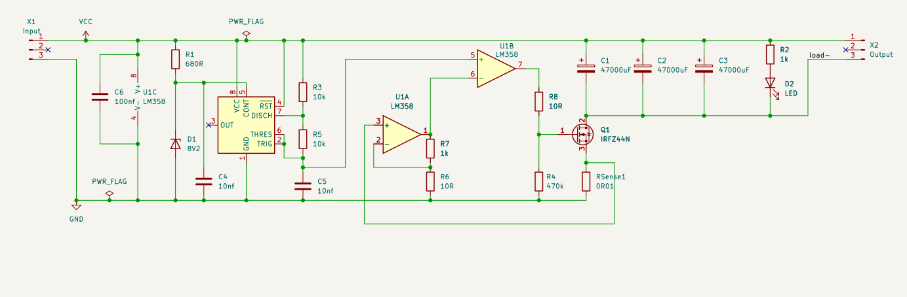
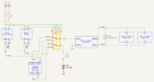
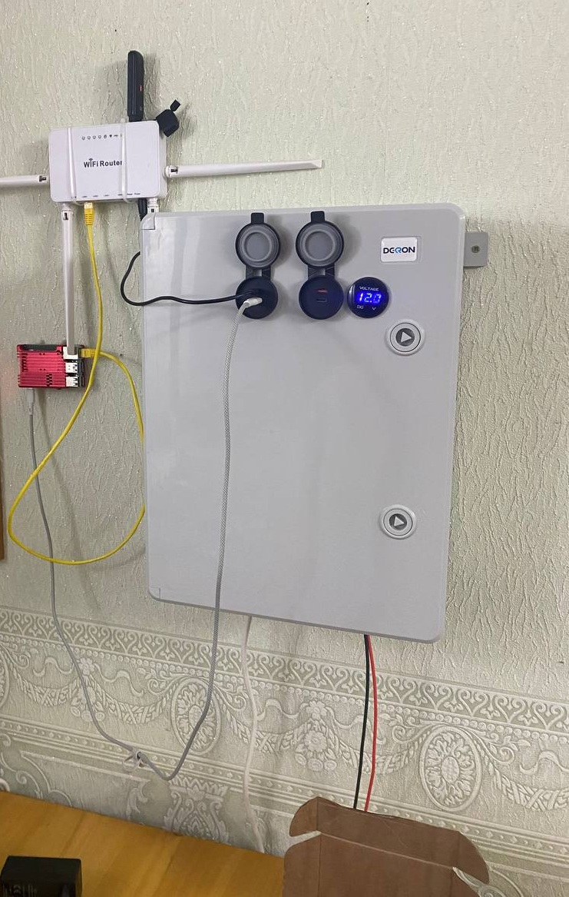
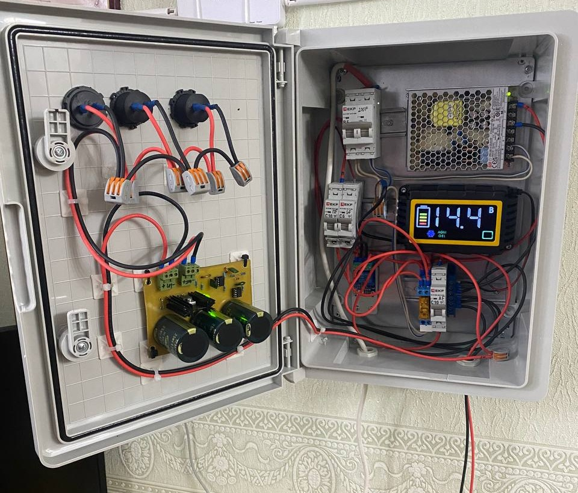

# UPS Current-Limited Load Switch

A current-limited, inrush-safe low-side load switch for a battery-backed UPS, built entirely from an NE555 timer and a dual op-amp — no dedicated hot-swap/current-limiter IC.

## What it does

- Switches the return path to a load (in this build: a Raspberry Pi + WiFi router) through an N-channel MOSFET (`Q1`, IRFZ44N).
- A current-sense amplifier (`U1A`) feeding a PWM comparator (`U1B`, both halves of one LM358) fold back the MOSFET's duty cycle as current rises, instead of a hard on/off cutoff or a linear-mode limiter (which would dissipate far more heat at these currents).
- The PWM ramp comes from an NE555 astable (`U2`), tapped directly off the timing capacitor node rather than `OUT`.
- A zener on the 555's `CONT` pin (`D1`, `R1`) pins the ramp's amplitude to a fixed voltage, so the current limit doesn't drift with input voltage (verified across 12–13.8V).
- With `R6` = 10Ω, `R7` = 1k (current-sense gain 101×) and `RSense1` = 0.01Ω: foldback begins around 4A, full cutoff around 8A — independent of supply voltage.
- The switched node also carries a 3×47000µF capacitor bank, so the same foldback loop doubles as inrush-current limiting when charging that bank from empty.

## Files

- `pcb2/pcb1.kicad_sch`, `pcb2/pcb1.kicad_pcb` — the design (KiCad 10)
- `pcb2/myLibrary.pretty/` — custom footprint for the current-sense shunt resistor
- `pcb2/kicad_export_commands.sh` — regenerates the ERC/DRC reports, netlist, and laser-burn artwork (copper layer, mirrored/negative variants, and a silkscreen+values placement guide) from the KiCad source

## Fabrication

Single-sided board. Components are inserted from one face; the copper (opposite face) has its solder mask removed with a laser engraver, then the main power-carrying traces are reinforced with solder for the ~8A current path. See `pcb2/pcb1_Fcu_mirrored.svg` / `pcb2/pcb1_Fcu_mirrored_negative.svg` for the burn artwork and `pcb2/pcb1_Silkscreen_Values.svg` for the component placement guide.

## Status

Built and running — powers a Raspberry Pi 4 and WiFi router off a 12V battery bank, verified across repeated input power cycling with no interruption to the load.

## System schematic

This load switch is one module in the larger UPS. The full system schematic shows how it connects to the rest: mains input through breakers into the AC/DC supply and battery charger, a DPDT relay (`K1`) for mains/battery switchover, over-discharge protection on the battery, and this load switch driving the output USB-C chargers.

`ups_schema/` holds this top-level schematic (KiCad 10, schematic-only — no PCB layout, since it's a system diagram rather than a board to fabricate).

## Build photos

| Enclosure, closed | Enclosure, open |
| --- | --- |
|  |  |

This board is mounted on the enclosure door alongside DIN-rail breakers, an AC-DC power supply (230VAC→12VDC), a battery charger, a main relay (230VAC-coil controlled), and an over-discharge protection board. The front panel carries a voltmeter and two 12V-powered USB-C charging ports.
